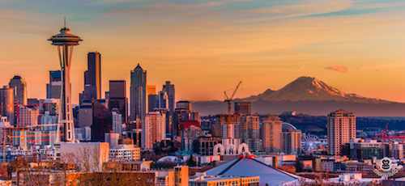
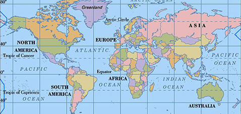
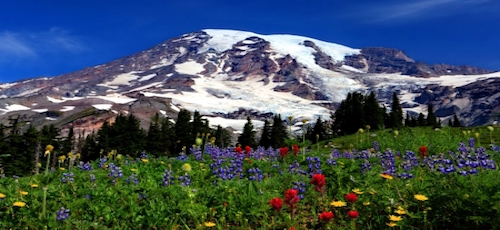
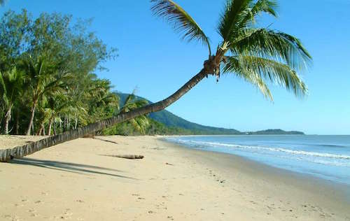
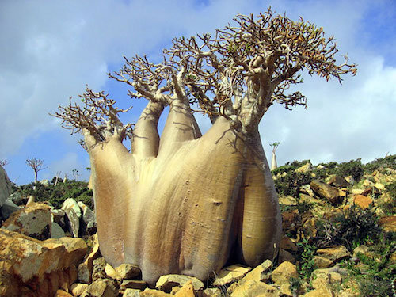

### About
My name is Leyth. I am a front-end developer based in Seattle, WA who made the transition from a previous career in Geographic Information Science (GIS). I completed a Bachelors in Geography from the San Diego State University and a Graduate Certificate in GIS from the University of Washington.

  

###First Encounter With Programming
My first encounter with programming was during the days of the primitive internet. One day, during an independent visit to the public library as a young student, I accidentally learned about the Gopher Protocol. A few years later, I taught myself basic `html` which allowed me to build a very basic static websites. As a result, my interest was irrevocably sparked by the mysterious World Wide Web. 

  

###Career Paths
I decided to enroll in Career Path Three and Four due to my desire to acquire in-depth knowledge of both frontend and backend technologies. After I graduate from Modern Developer, I would like to work as a Fullstack developer in a really interesting startup of my choosing.

  

###Goals
My ultimate goal is to acquire expert-level knowledge of the `JavaScript` language. Suffice to say, Modern Developer promises me just that &mdash;as long as I am willing to work hard  and persevere.

  

###Perseverance
Prior to college, I had made the firm resolution to avoid accumulating debt of any kind (loans or otherwise) during my tenure as a student. In order to accomplish this goal, I had to learn the true meaning of *perseverance*. 

The greatest test of my resolve and grit came in the course of my sophomore year. During this crucial time, I was to balance between  a full-time student course-load and maintaining two jobs. In contrast, I had previously enjoyed a relatively light-load in my freshmen year. The initial phase of adjustment took a heavy toll on me, mentally and physically. By taking steps to dealing with the high-level stress, I was eventually able to persevere and accomplish my goals. Two years later, I graduated from college completely **debt-free.**

> Perseverance is failing 19 times and succeeding the 20th.
>
> -- <cite>Julie Andrews</cite>

###Hobbies
In my leisure time, I like learning about anything relating to *geography*. Whether it is learning about soil types of a particular region, or, ratios  of continents against one another, I have always enjoyed gaining any type of geographical knowledge that helps me build awareness of the spatial complexity of the world.
 
  

###Life in Seattle
Seattle, a beautiful city situated in the Pacific Northwest of the United States,  makes for a really interesting place to live, particularly for nature lovers such as myself. On any given day, I enjoy views of Mount Rainier to the South, the Cascade Mountain Range in the East, and the Olympic Mountain Range in the West. The City is hemmed in by two prominent bodies of water &mdash;  *Lake Washington in the East and, most notably, Puget Sound.*

  

###Most Enjoyable Experiences
Some of the fondest memories I have of growing up in San Diego, California were that of the summer time. Before high school, I would spend most of the summers on the beach. However, during my high school years, I had to spend the better part of the summers working odd jobs in order to help support my family. Thankfully, things turned out for the best during the summer of my junior year. Suprisingly, I found a job doing beach clean-up. Given that there wasn't much clean-up to do during that particular summer, I ended up spending most of my time in the water. This arrangement worked out perfectly for me; I was able to fulfill my responsibilities while doing what I loved.
 
  

###Favorite Destination
If I were to be given the opportunity to travel anywhere in the world, I would visit the geologically isolated Socotra Island. This island, which is a small archipelago of four other islands in the Indian Ocean, is one of the most spectacular islands of the world as it is considered a jewel of biodiversity. Socotra Island has well over 700 endemic species which are not found anywhere else on earth. In this sense, Socotra has a lot in common with the diversity present in the Galapogas Islands.
 
  

