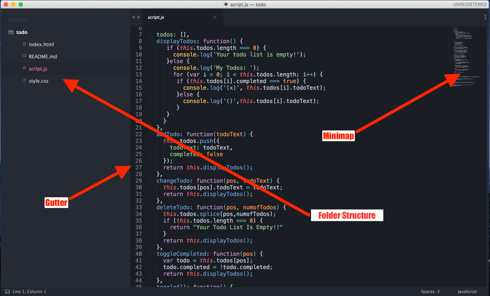

Applying Platform-Specific Settings in Sublime Text
===================================================

1. Read the Sublime Text license on the web site (Buy section) and explain what you need to do if you want to use it on multiple computers.

In order to use multiple computers, there is license per-user that can be used in mutlipe computers. Sublime Text policy states: 

>Licenses are per-user, so you're welcome to use the one license on all computers and operating systems where you are the primary user. For businesses, the number of users must equal the number of licenses.

2. Include a screenshot of an open file in Sublime Text, label the different UI elements (the gutter, minimap, etc.) and explain the function of each of these elements.

* * *

On the left panel, the project folder structure is displayed showing the current selected file along with other file in the main root project folder. On the top-left side is the a minimap of the code area which comes very hand when working on a long file; it allows for easy scroll. In addition, in the bottom left is the gutter area. This area is useful and works well with several custom plugins. For example, it can display notification coming via debugger when an error in the code is detected. In addition, you can allow small icons to show which indicate which lines have been added, modified, or deteleted.

3. Describe the function of keyboard shortcuts and their relationship to the \'Default.sublime-keymap\' and \'Default().sublime-keymap\' files. Include a screenshot of one of these files, highlighting one shortcut and describe how it works.

* * *

This keyboard shortcut allows users to browser (Chrome) without clicking the refresh button. To use this shortcut, all you have to do is hold `command` + `shift`+ `r`

4. Describe how you would go about changing settings for a third-party plugin.

There are several ways to change settings for a third-party plugin. The easiest way is to go to: `Preference` --> `package settings` ---> `third-party plugin of your choice` --> `settings-default`. 

5. Describe the function of project and folder settings. Describe the files used to access and change these settings (use screenshots).

Projects in Sublime Text are made up of two files: the sublime-project file, which contains the project definition, and the sublime-workspace file, which contains user specific data, such as the open files and the modifications to each.

As a general rule, the sublime-project file would be checked into version control, while the sublime-workspace file would not.

sublime-project files are JSON, and support three top level sections: folders, for the included folders, settings, for file-setting overrides, and build_systems, for project specific build systems. An example:

* * * 

6. Describe the function of settings files that have the name of a platform (OS) in their name.

There are two types of global settings files affecting file types: Base File and Base File (Platform). Base File is always in effect for all platforms, whereas the second one only applies to the named platform. Multiple Base File and Base File (Platform) files can coexist.

If you want to target a specific file type in a .sublime-settings file, give it the name of the applicable syntax definition for said file type. Note you have to use the syntax definition’s file name, not a scope name. For example, if our syntax definition was called Python.tmLanguage, we’d need to call our settings file Python.sublime-settings. Settings files for specific file types usually live in packages, like Packages/Python, but there can be multiple settings files for the same file type in separate locations.
