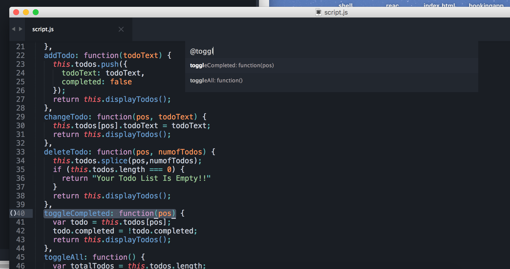
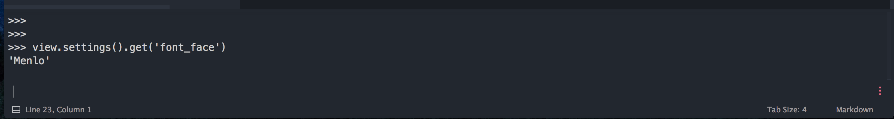

1
=== 

Describe the function of Sublime Text "quick lists" (include a screenshot).

* * * 

Sublime Text has a "quick lists" feature that allows for fast searching capabilities. This is defined in the `Goto Definition` in Sublime Text. It works by indexing the files in the curent project in order to find the where each symbol is defined in.

* * *

2 
===

Describe the function of the Python variables "view" and "window" made available by Sublime Text.

**View**:  Represents a view into a text buffer. Note that multiple views may refer to the same buffer, but they have their own unique selection and geometry.

**Window**: Returns a list of all the open windows.

3 
===

Explain the advantage of working with settings on the Python console; then, describe how to view and change settings on the Python console (use screenshots).

There are great advantages of working with settings on the Python console. For example, sometimes in can be helpful to view the applied setting that's actually being used by the current file. Here is a quick example of viewing the type of font which my Sublime Text is using: 

4 
===

Outline the steps required to create a new Sublime Text project (include screenshots).

- 1 Click `Project`
- 2 Click `Save Project As...`
- 4 Pick a directory and choice a name and then click `save`

After this, you will have a new project with a new file called `your-project-name-.sublime-project` which has the configurations.

![config file] (http://markonphp.com/media/uploads/2014/11/xdebug15.png)

In this file, you will need to change `path` and `url` as well as other settings specific to your project.

5 
===

Describe some common Sublime Text folder settings (folder_exclude_patterns, folder_include_patterns, file_exclude_patterns, file_include_patterns, binary_file_patterns) and explain what they do.

