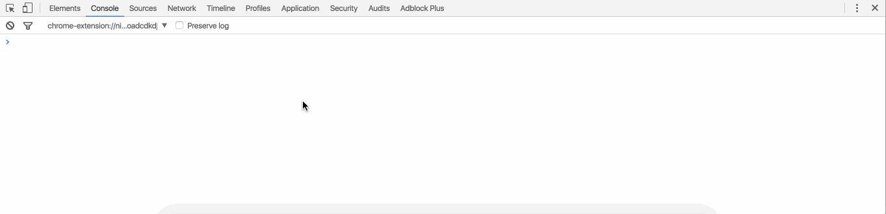
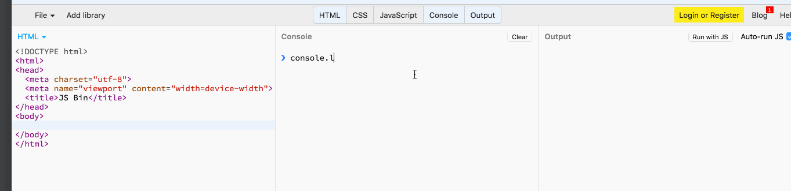
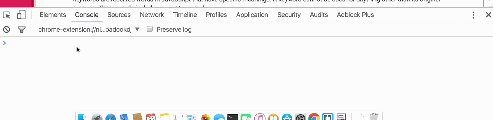
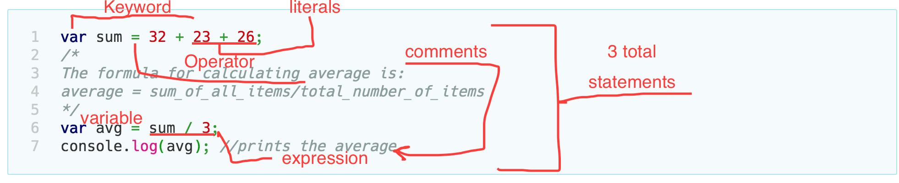

### Exercises

1.Run console.log(5); in your browser’s console.
* * *



- - -
2.Run console.log(5); on the JSbin website.

- - -

3.Print your name to the console. Hint: Put your name in double quotation marks.
- - -


- - -
1.From your understanding of expressions and statements, write the difference between them.

In JavaScript, a statement is made of keywords, comments, literals, variables, and expressions. On the other hand, an expression is a combination of literals, variables and special operators that show a value as their result. Calculation can be done on expressions while this is not true for statements.

- - -

2.Identify the keywords, comments, literals, variables, operators, and expressions in the following program. How many statements are there?



- - -
1. Without running the following program can you guess the output?

```JavaScript
    var a;
    console.log(a);
```

Answer: the output will be `undefined` because the variable `a` has been declared but not assigned to any value.


- - -

2.Divide `100` with `0` and print the result to the console. What is the data type of the output?

Answer:

output: `Infinity`

date type: `number`


- - -

3.Create an array with 3 items: `"banana", "apple", "orange"`. Print all these items using index only.

```JavaScript
    var fruits = ["banana", "apple", "orange"];

    fruits[0] // banana
    fruits[1] // apple
    fruits[2] // orange

```

4.Print the last element of an array. Make sure you test your program with arrays of different sizes.

```JavaScript
    console.log(fruits[fruits.length - 1]) // orange
```


- - -


1.Experiment with the precedence of arithmetic and logical operators. Write a short report of your findings.

In JavaScript, the highest predence in arithmetic operators is given to the multiplication operator (`*`). After this, then the addition is the next in line. However, the operations inside of parentheses are computed first regardless whether it is addition, subtraction, or multiplication.

Moreover, for the logical operators, the (`&&`) takes precedence over all others. But if all others were to be compared, then the precedence rule is as follows:

- Grouping: `()`
- Not: `!`
- Comparison: `<, >=, ===, ..`
- Logical AND: `&&`
- Logical OR: `||`


2.What happens when a boolean is added with a number or a number is added with a string. Experiment on the arithmetic, logical, and comparison operations of different types, i.e., numbers, booleans, and strings. Write a short report of your findings.

When a boolean is added to a number, a number is returned. Interestingly, when the `typeof` this output is checked, it returns `number` as its data type. In addition, when a number is added to a string, the number is converted to a string.

3.Write a program that converts celsius temperature to fahrenheit and vice versa. The formula for conversion is: \frac{c}{5} = \frac{f-32}{9} where c represents celsius and f represents fahrenheit.

#### Celsius to Fahrenheit

```JavaScript
    var toF = function(c) {
       // when no value given, set to average global temp.
       c = c || 14;
       var fahrenheit = (c * 9/5) + 32 + " \xb0F";
       return fahrenheit;
    }
```


#### Fahrenheit to Celsius

 ```JavaScript
    var toC = function(f) {
        // global average temp
        f = f || 57.2;
        var celsius = (f - 32) * 5/9 + " \xb0F";
        return celsius;
    }
 ```

4.Find the maximum of two numbers using the ternary operator. You can assume that the numbers are not equal.

```JavaScript
    var a = 10;
    var b = 5;

    a > b ? a : b; // 10
```

5.Multiply three numbers together and output whether the result is positive or negative. For example, if the input is 1, 2, 3 your program should output positive. Similarly, for 1, -2, 3 it should output negative. Hint: You can use the ternary operator.


```JavaScript
    function pn(a,b,c) {
        return a * b * c < 0 ? 'negative' : 'positive';
    }
```
